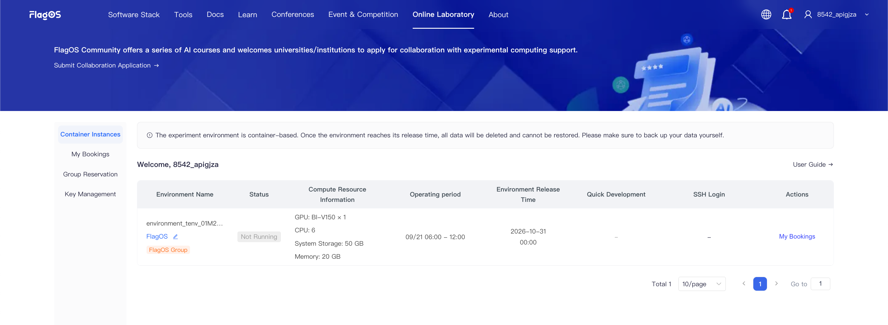
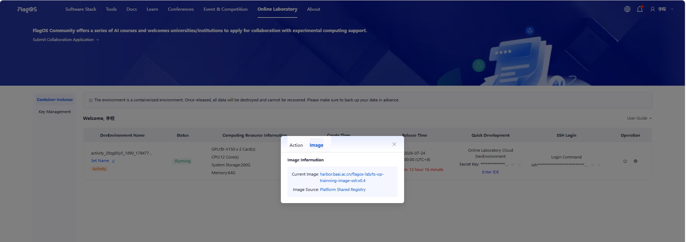
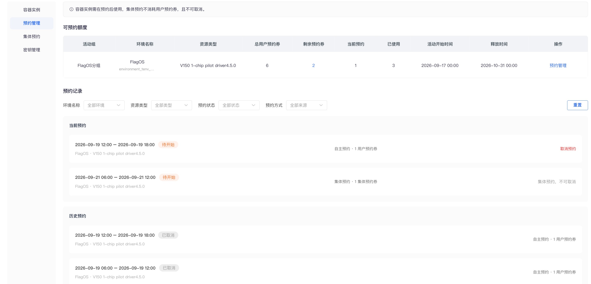
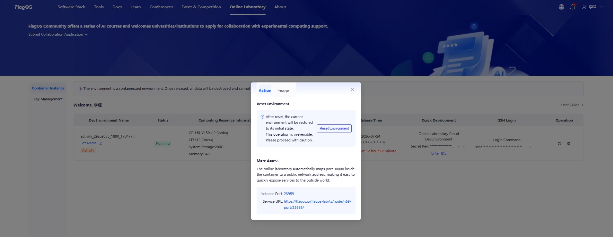
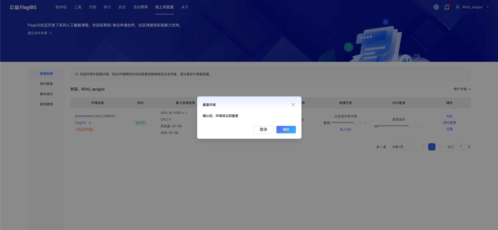

# Online Laboratory User Guide

## Getting Started

1. Open <https://flagos.net/Home> in your browser.

2. Click **Online Laboratory** at the top. Select **Phone Login** or **Email Login**. Enter your phone number or email address, and click **Get Verification Code**. Enter the verification code, check the box to accept the community usage agreement and privacy policy, and click **Login/Register Now**.

3. View all unreleased container instances, reservation information, access endpoints, and other related information associated with your account.
   

4. If there is a **Reservation Management** menu in the left sidebar of your Online Laboratory, your container instance is in **Reservation mode**, and you should refer to the **Reservation Usage** section of this guide. If there is no such menu, the container instance is in **Dedicated mode**.

5. On the **Container Instance** page, in the **Operation** column, check the image information:
   1. Navigate to **Operation**, and click Settings .
   2. In the pop-up window, click **Image**.
      

## Reservation Usage

### Reservation Rules

1. To ensure the overall resource utilization of the platform, the platform allocates reservation vouchers when a container instance is created, and the container instance is then used within fixed time slots by reservation.

2. The fixed time slots are divided by Beijing time as follows: 0:00-6:00, 6:00-12:00, 12:00-18:00, and 18:00-24:00. Reserving one time slot consumes one reservation voucher, and the entire slot is reserved for you.

3. The instance container is automatically pre-warmed and allocated at the start of the reserved time slot. Click **Start** to use it. When the slot ends, the system automatically saves the changes inside the container, shuts it down, and releases it.

4. If the reserved time slot is not actually used, the reservation voucher is not refunded.

5. Reservation vouchers are divided by type. The Reservation Management menu displays and operates on user reservation vouchers or collective reservation vouchers.

6. Time slot reservations for a container instance can be made starting 7 days before the activity begins, and only slots within 7 days from the current time can be reserved. Consecutive reservations are supported (the container is not shut down in between).

7. To ensure a good experience, real-time reservation is not supported for now. The reservation deadline for each time slot is 15 minutes before the slot starts (for example, after 11:45 on the same day, the 12:00-18:00 slot can no longer be reserved).

8. User or collective reservations can be cancelled before the time slot starts, and the corresponding reservation voucher is refunded. Collective reservations cannot be cancelled by regular users.

9. When the reserved time slot ends, the system automatically shuts down the container and saves the data inside it (the data is not destroyed). When the voucher's release time is reached, the system releases the container and destroys the data inside it. Please make sure to keep your own copy of your data.

### Container Instance

1. A container instance in Reservation mode can only be accessed within the reserved time slots.

2. To check the current and reserved time slots of a container instance, see the **Runtime Period** column.

3. In the Operation column, click **Reservation Management** to jump to the reservation drawer of the corresponding container instance on the Reservation Management page, where you can reserve runtime slots.
   

4. After the reservation is allocated, the environment container is in the powered-off state. Click **Start** in the Operation column to start it manually.

### Reservation Management

1. The Reservable Quota list shows the container instance and reservation voucher information, and is used to make reservations for the instance.
   1. When the current time is more than 7 days before the activity start time, the container instance cannot be reserved.
   2. When the remaining reservation vouchers are 0, the available quota of this container instance is used up, but this does not affect reservations for other container instances.

2. In the reservation records, self reservations or collective reservations that have not started yet can be cancelled. Collective reservations cannot be cancelled by regular users in the activity group.
   

3. If a collective reservation conflicts with an existing user reservation, the system automatically cancels the user reservation and refunds the corresponding user reservation voucher.

## Online Development Environment

### Environment Access

After starting the instance, you can use one of the following methods to access the cloud-based online development environment:

- **Option 1: SSH Connection**
  To access the development environment via SSH, follow these steps:
  1. Create a public key on your computer.
  2. In the **SSH Login** column, click **Go to Key Management for configure**.
  3. On the **Key Management** page, click **Add Public Key** in the upper left corner.
  4. In the **Add Public Key** dialog box, paste the public key created on your computer into **SSH Public Key**, fill in the public key name in **Public Key Name**, and click **Submit**.
  You can also click **Edit** or **Delete** to edit or delete a public key.
- **Option 2: Direct Access to the Development Environment**
  To access the environment directly, follow these steps:
  1. In the **Quick Development** column, next to **Secret Key**, click the Copy icon  to copy the key.
  2. Click **Enter IDE**. When the Welcome dialog opens, paste the key and click **Submit**.
  
- **Option 3: Access via Public Network**
  To access the development environment from a public network, follow these steps. You can map the service for the development environment to port 30000.
  1. In the **Operation** column, click Settings .
  2. In the pop-up window, click **Action**. In the **More Access** section, click the **Service URL** link to open the development environment.
  

### Querying the Computing Configuration

Query the computing power configuration through terminal commands according to the GPU card type.
- For Iluvatar GPU cards, use the command:

   ```{code-block} bash
   ixsmi
   ```

  
- For Huawei Ascend NPU cards, use the command:

   ```{code-block} python
   npu-smi info
   ```

  

### Uploading / Downloading Files

You can upload or download files such as code packages and models through the following methods:
- Right-click your `Workspace` and select **Upload...**
  
- Right-click your `Workspace` and select **Download...**
  

```{warning}
The experimental environment is a containerized environment. All data will be permanently deleted and unrecoverable upon release. Please back up your data locally in advance.
```

For detailed usage instructions of Visual Studio Code, please refer to: <https://code.visualstudio.com/docs>.

## Reset Environment

To reset the development environment to its initial state, perform the following steps:

1. Navigate to the **Operation** column, and click Settings .
2. In the pop-up window, click **Action**. In the **Reset Environment** section, click **Reset Environment**. In the **Reset Environment** pop-up window, click **Confirm**.
  

```{warning}
This action is irreversible. Please proceed with caution.
After the environment is reset, all data will be permanently deleted and cannot be recovered. Please make sure to back up your data locally in advance.
```
