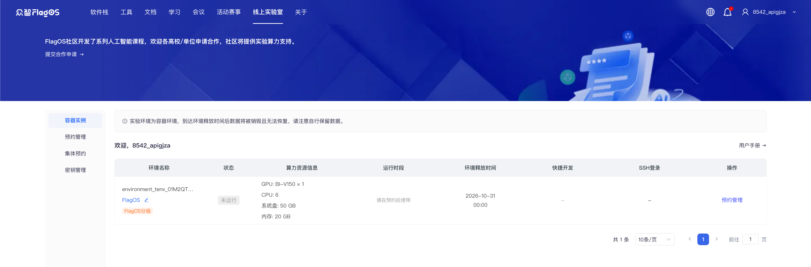
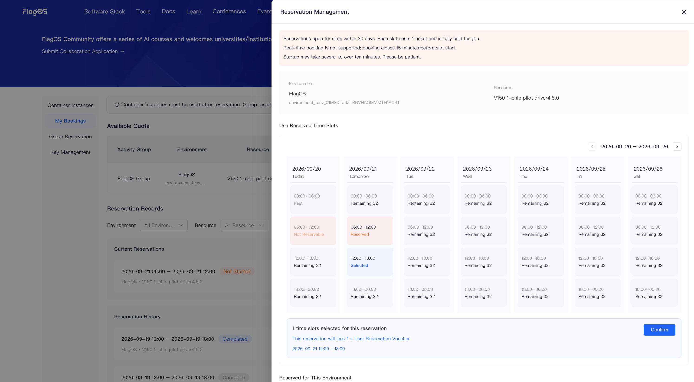
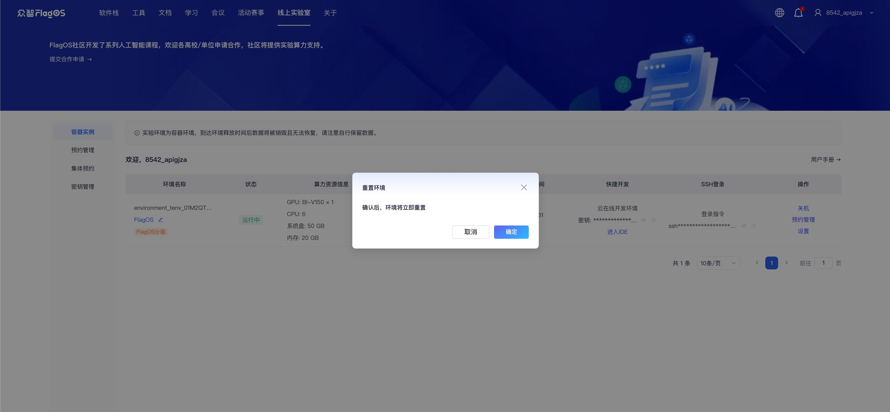

# 线上实验室用户指南

## 快速上手

1. 在浏览器中打开<https://flagos.net/Home>。

2. 点击上方的 **线上实验室**。选择**手机号登录**或者**邮箱登录**。输入手机号或者邮箱账号，并点击**获取验证码**。填入验证码后，勾选接受社区使用协议及隐私协议，点击**立即登录/注册**。

3. 查看与你账号关联的所有未释放的容器实例、预约信息、访问入口及其他相关信息。
   

   ```{note}
   - 如你的线上实验室左侧菜单中有**预约管理**菜单，则你的容器实例为**预约模式**，请关注本指南中的**预约模式**部分。
   - 如没有该菜单，则容器实例为**专属模式**，请关注本指南中的**专属模式**部分。
   ```

## 1. 预约模式

### 预约规则

- 为保证平台整体资源利用率，平台将在创建容器实例时分配预约券，后续容器实例将按固定时段预约使用。

- 平台将固定时段按北京时间划分为：0:00-6:00、6:00-12:00、12:00-18:00、18:00-24:00，每预约一个时段将消耗一张预约券，预约时段内将整段保留。

- 实例容器将在预约的时段开始时自动预热分配，点击开机即可使用，时段结束后系统将自动保存容器内改动并关机释放。

- 如在预约时段中未实际使用，预约券不返还。

- 预约券有类型区分，预约管理菜单中展示和操作的是用户预约券或团队预约券。

- 在活动开始前 7 日可开始进行容器实例的时段预约，可预约距当前时间 7 日内的时段，可连续预约（中途不关机）。

- 为保证使用体验，暂不支持实时预约，每一时段的预约截止时间为此时段开始时间的前 15 分钟（例：当日 11:45 后不允许再预约 12:00-18:00 时段）。

- 用户或团队预约可在时段开始前取消，将返还对应预约券，集体预约不可由普通用户取消。

- 预约时段结束后系统将自动关机并保存容器内数据（不销毁数据），到达券的释放时间后系统将释放容器并销毁容器内数据，请注意自行保留数据。

### 预约时段并开启容器实例

预约模式的容器实例，仅可在预约时间段内进入容器。

1. 在**容器实例**页面，通过**运行时段**列查看容器实例的当前及预约时段。

2. 在**操作**列中，点击**预约管理**，即可跳转至预约管理页中对应容器实例的预约抽屉，进行运行时段的预约。
   

3. 选择可预约的一个或多个时段并点击**确认**后，时段即预约成功，页面将跳转至**预约管理**页签。

   - 可预约额度列表用来展示容器实例及预约券信息，以及对实例进行预约操作。
      - 当前时间距离活动开始时间超过 7 日时，容器实例不可预约。
      - 当剩余预约券为 0 时，即代表此容器实例的可用额度已用尽，但不影响其他容器实例进行预约。

   - 在**预约记录**中，普通用户可取消本人自主预约，活动组管理员可取消尚未开始的集体预约。
      

  ```{note}
   - 如需预约当前时段，请向管理员确认该时段是否可用。如可用，管理员可代你选择该时段。管理员预约的时段将显示在**当前预约**区域，实例状态将变为**运行中**。

   - 如集体预约与已预约的用户自主预约发生冲突，系统将自动取消用户预约，并返还对应的用户预约券。
   ```
  
4. 返回**容器实例**页签，环境容器为关机状态。当预约时段到来时，在**操作**列中点击**开机**以启动实例。

## 2. 专属模式

在**容器实例**页面，通过**操作**列查看镜像信息：
  
  1. 导航至**操作**，并点击设置。
  2. 在弹出的窗口中，点击**镜像**。
      


## 在线开发环境中的操作

### 访问在线开发环境

在开启实例后，可使用以下任一方式访问云端在线开发环境：

- **方式一：SSH链接**
  如需SSH访问开发环境，请按照以下步骤操作：
  1. 在您的电脑上创建公钥。
  2. 在**SSH登录**列中，点击**前往密钥管理进行配置**。
  3. 在**秘钥管理**页面，左上角点击**添加公钥**。
  4. 在**添加公钥**的对话框中，在**SSH公钥**中粘贴电脑上创建的公钥并在**公钥名称**填写公钥名称，点击**提交**。
  您也可以点击**编辑**或**删除**来编辑或删除公钥。
- **方式二：直接访问开发环境**
  如需直接访问开发环境，请按以下步骤操作：
  1. 在**快捷开发**列中，在**密钥** 旁点击复制图标，复制密钥。
  2. 点击 **进入IDE**。在弹出的 Welcome 对话框中粘贴密钥，并点击 **Submit**。
  
- **方式三：通过公网访问**
  如需通过公网访问开发环境，请按以下步骤操作，可将开发环境的服务映射到端口 30000。
  1. 在**操作**列中，点击设置。
  2. 在弹出的悬浮窗口中，点击 **操作**。在**更多访问**区域中点击**服务地址**链接以打开开发环境。
  

### 查询算力配置

根据显卡类型，通过终端命令查询算力配置信息。

- 对于天数加速卡，使用以下命令：

   ```{code-block} bash
   ixsmi
   ```

  
- 对于华为昇腾加速卡，使用以下命令：

   ```{code-block} python
   npu-smi info
   ```

  

### 上传和下载文件

您可以从本地位置上传文件、下载文件到本地位置，例如代码包等，可通过以下方式：

- 在 `Workspace` 上点击右键，选择 **Upload...**
  
- 在 `Workspace` 上点击右键，选择 **Download...**
  

```{warning}
实验环境为容器化环境，在释放后所有数据将被永久删除且无法恢复，请务必提前在本地备份数据。
```

关于 Visual Studio Code 的详细使用说明，请参阅：<https://code.visualstudio.com/docs>。

## 环境重置

要将开发环境重置为初始状态，请执行以下步骤：

1. 导航至**操作列**，并点击设置。
2. 在弹出的窗口中，点击**操作**。在**重置环境**部分，点击**重置环境**。在**重置环境**弹出窗口中，点击**确定**。
  

```{warning}
此操作不可逆，请谨慎操作。
在环境重置后所有数据将永久删除且无法恢复，请务必提前在本地备份数据。
```
